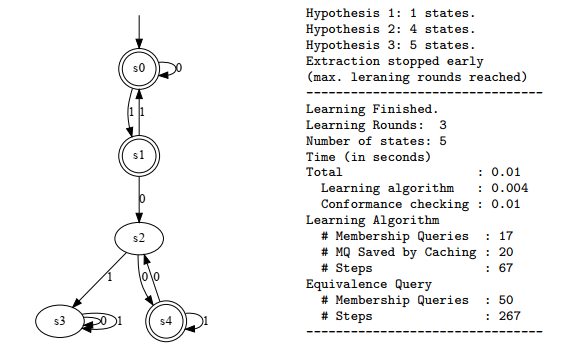

# Black-Box Extraction of RNN's Input-Output Behaviour via Automata Learning
This repo contains source code that showcases how one can use automata learning to extract finite-state models capturing the RNN's input-output behaviour.

#### Short example
```python
from aalpy.learning_algs import run_Lstar
from aalpy.oracles import StatePrefixEqOracle
from aalpy.utils import save_automaton_to_file, visualize_automaton

from DataProcessing import parse_data, preprocess_binary_classification_data
from RNN_SULs import RnnBinarySUL
from RNNClassifier import RNNClassifier

from TrainAndExtract import train_RNN_on_tomita_grammar, train_and_extract_bp, train_RNN_and_extract_FSM

# Train the RNN on the data set generated from Tomita 3 Grammar
tomita_alphabet = ["0", "1"]
# load training data from file
x, y = parse_data("TrainingDataAndAutomata/tomita_3.txt")
# split test and validation data
x_train, y_train, x_test, y_test = preprocess_binary_classification_data(x, y, tomita_alphabet)

# Change parameters of the RNN if you want
rnn = RNNClassifier(tomita_alphabet, output_dim=2, num_layers=2, hidden_dim=50, batch_size=18,
                    x_train=x_train, y_train=y_train, x_test=x_test, y_test=y_test, nn_type="LSTM")

# Train the RNN
rnn.train(stop_acc=1.0, stop_loss=0.0005)

# Wrap RNN in the SUL class. 
sul = RnnBinarySUL(rnn)
alphabet = tomita_alphabet

# Define the eq. oracle
state_eq_oracle = StatePrefixEqOracle(alphabet, sul, walks_per_state=200, walk_len=6)

# Extract the model from RNN
# Max. number of rounds is limited to be able to visualize small/correct automata.
# If it is not set adversarial inputs will be found :D 
dfa = run_Lstar(alphabet=alphabet, sul=sul, eq_oracle=state_eq_oracle, automaton_type='dfa',
                cache_and_non_det_check=True, max_learning_rounds=3)

save_automaton_to_file(dfa, f'RNN_Models/tomita{3}')
visualize_automaton(dfa)
```


## Interactive notebooks/running examples
In the `notebooks` folder, you can find many examples and associated outputs. Examples are:
- Train an RNN on the Tomita grammar and Extract DFA
- Train an RNN on the coffee machine FMS and Extract Mealy/Moore machine
- Learn abstract model from the RNN trained on the concrete traces from MQTT protocol
- Falsify models returned by refinement-based white-box approach
- Conformance check 2 RNNs trained on the same data
- Training set extension based on conformance checking of extracted automata

## Structure of the repo:
- `LearnedAutomata/` - automata representing the behavior of RNN's inferred via automata learning
- `TrainingDataAndAutomata/` - data and automata used for RNN training and verification 
- `RNN_Models/` - weights of the pre-trained RNNs
- `Refinement-based_extraction/` - [source code]((https://github.com/tech-srl/lstar_extraction)) from [very interesting paper](http://proceedings.mlr.press/v80/weiss18a/weiss18a.pdf)u on automata extraction from RNNs
- `Notebooks` - interactive examples
##
- `DataProcessing.py` - a collection of helper functions used to prepare data for learning
- `RNNClassifier.py` - lass used for training RNNs, either LSTM or GRU
##
- `RNN_SULs` - system under learning. Implements [AALpy](https://github.com/DES-Lab/AALpy)'s SUL class
- `TrainAndExtract.py` - helper function in which one can see how to train RNNs and extract their behavior via automata learning
##
- `Comparison_with_White_Box.py` - comparison of our approach to [Weiss et al.](https://github.com/tech-srl/lstar_extraction)
- `Applications.py` - a proof-of-concept for learning RNNs abstract behavior with mapper component, and learning-based testing of multiple trained RNNs and their applications

## Install and Run

To run extraction, only dependencies are [AALpy](https://github.com/DES-Lab/AALpy) and [Dynet](https://dynet.readthedocs.io/en/latest/).
However, to run a comparison with the refinement-based approach proposed by Weiss et al., further dependencies are required.

To install, clone this repo (suggestion: create a python virtual environment) and call
``
pip install -r  requirements.txt
``

`TrainAndExtract.py`, `Comparison_with_White_Box.py`, and `Applications.py` all have main function defined at the bottom of the file.
`quick_start.py` has the simple minimal example that shows how to train RNNS and extract multiple models.
Notebooks folder contains the text output/interactive examples for some examples.
Furthermore, interactive notebooks can be found in the `notebooks` folder.
