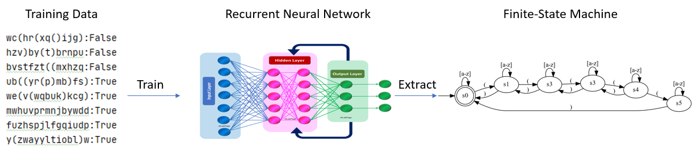

# Black-Box Extraction of RNN's Input-Output Behaviour via Automata Learning

This repo contains source code that showcases how one can use automata learning to extract finite-state models capturing the RNN's input-output behaviour.
Few possible application of this approach are also presented.

## Structure of the repo:
- `LearnedAutomata/` - automata representing behaviour of RNN's inferred via automata learning
- `TrainingDataAndAutomata/` - data and automata used for RNN training and verification 
- `Refinement-based_extraction/` - [source code]((https://github.com/tech-srl/lstar_extraction)) from very interesting paper on automata extraction from RNNs[Extracting Automata from Recurrent Neural Networks Using Queries and Counterexamples](http://proceedings.mlr.press/v80/weiss18a/weiss18a.pdf)
##
- `DataProcessing.py` - collection of helper functions used to prepare data for learning
- `RNNClassifier.py` - lass used for training RNNs, either LSTM or GRU
##
- `RNN_SULs` - system under learning. Implements [AALpy](https://github.com/DES-Lab/AALpy)'s SUL class
- `TrainAndExtract.py` - helper function in which one can see how to train RNNs and extract their behaviour via automata learnig
##
- `Comparison_with_White_Box.py` - comparison of our approach to [Weiss et al.](https://github.com/tech-srl/lstar_extraction)
- `Applications.py` - proof-of-concept for learning RNNs abstract behaviour with mapper component, and learning based testing of multiple trained RNNs and its applications

## How to Install and Note on Dependencies

To run extraction, only dependencies are [AALpy](https://github.com/DES-Lab/AALpy) and [Dynet](https://dynet.readthedocs.io/en/latest/).
However, to run comparison with refinement-based approach proposed by Weiss et al, further dependencies are required.

To install, clone this repo, (suggestion: create a python virtual environment) and call
``
pip install -r  requirements.txt
``

## How to Run

`TrainAndExtract.py`, `Comparison_with_White_Box.py`, and `Applications.py` all have  main function defined at the bottom of the file.
Notebooks folder contains the text output/interactive examples for some examples.
Furthermore, interactive notebooks can be found at TODO.
